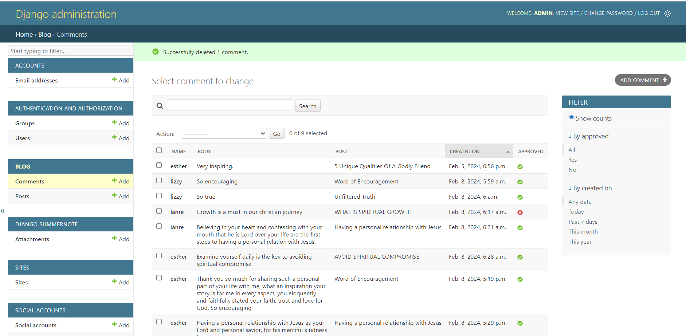

# Christian Youth Blog

**Developer: [Lanre James Andero]**

💻 [Visit live website](https://cy-django-blog-486df1fc929f.herokuapp.com/)

## About

Welcome to the Christian Youth Blog! This platform aims to provide a space for Christian youth to explore, share, and engage with content that aligns with their faith and values. Discover articles, stories, and discussions that inspire and connect the Christian youth community.

## Table of Contents

  - [Project Goals](#project-goals)
    - [User Goals](#user-goals)
    - [Site Owner Goals](#site-owner-goals)
  - [User Experience](#user-experience)
    - [Target Audience](#target-audience)
    - [User Requirements and Expectations](#user-requirements-and-expectations)
    - [User Manual](#user-manual)
  - [User Stories](#user-stories)
    - [Users](#users)
    - [Site Owner](#site-owner)
  - [Technologies Used](#technologies-used)
    - [Languages](#languages)
    - [Frameworks & Tools](#frameworks--tools)
    - [Libraries](#libraries)
  - [Features](#features)
  - [Validation](#validation)
  - [Testing](#testing)
    - [Manual Testing](#manual-testing)
    - [Automated Testing](#automated-testing)
  - [Bugs](#bugs)
  - [Deployment](#deployment)
  - [Credits](#credits)
  - [Acknowledgements](#acknowledgements)
  - [License](#license)
  - [Contact](#contact)

## Project Goals

### User Goals

- Access content that aligns with Christian values.
- Engage with a community of like-minded Christian youth.
- Find inspiration, guidance, and encouragement through blog articles.

### Site Owner Goals

- Establish a platform for Christian youth to share and explore content.
- Foster a sense of community and connection among Christian youth.
- Provide valuable and uplifting content that resonates with the target audience.

## User Experience

### Target Audience

The Christian Youth Blog is designed for Christian youth aged 13-25 who seek a positive and faith-centered online community.

### User Requirements and Expectations

- Access to a user-friendly blog platform.
- Relevant and engaging blog content that reflects Christian principles.
- Opportunities to connect and interact with other users.
- A safe and respectful online environment.

### User Manual

Click here to view instructions

#### Navigating the Blog
Upon entering the blog, users will find a clean and intuitive interface. Key navigation options include:
1. Home - Explore the latest blog posts.
2. About - Learn more about the blog's mission and values.
3. Register - New users can sign up
4. Login - Registered users can sign in
5. Signed In - Users can create, edit and delete own posts, comments and likes/unlikes posts.
6. Logout- Singned in users can logout of their accounts

Home Page Navigations

#### Reading Blog Posts
Click on a post to read its full content. Users can leave create own posts, comments, likes/unlikes, edit and delete own posts.

Blog Posts

[Back to Table Of Contents](#table-of-contents)

## User Stories

### Site Admin

1. **As a Site Admin, I can create, read, update, and delete posts so that I can manage my blog content.**

2. **As a Site Admin, I can create draft posts so that I can finish writing the content later.**

3. **As a Site Admin, I can approve or disapprove comments so that I can filter out objectionable comments.**

4. **As a Site Admin, I can approve or disapprove posts so that I can filter out objectionable posts.**

Site Admin Rights

### Site User

1. **As a Site User, I can like or unlike a post so that I can interact with the content.**

2. **As a Site User, I can view a paginated list of posts so that I can select which post I want to view.**

3. **As a Site User, I can view the number of likes on each post so that I can see which is the most popular or viral.**

4. **As a Site User, I can view a list of posts so that I can select one to read.**

5. **As a Site User, I can click on a post so that I can read the full text.**

6. **As a Site User, I can register an account so that I can comment, like and unlike.**

7. **As a Site User, I can leave comments on a post so that I can be involved in the conversation.**

8. **As a Site User, I can view comments on an individual post so that I can read the conversation.**

9. **As a Site User, I can edit and delete own posts so that I can review my conversation.**

Site Users Rights

## Technologies Used

### Languages

- HTML
- CSS
- JavaScript
- Python

### Frameworks & Tools

- Django
- Bootstrap
- Flake8 - was used to check my code against Python conventions
- W3C
- [Font Awesome](https://fontawesome.com/) - icons from Font Awesome were used in the footer below the program terminal
- [GitHub](https://github.com/) was used as a remote repository to store project code
- [Heroku Platform](https://https://heroku.com/) was used to deploy the project into live environment

### Libraries

- asgiref==3.7.2
- bleach==3.3.1
- certifi==2024.2.2
- cffi==1.16.0
- charset-normalizer==3.3.2
- cloudinary==1.38.0
- crispy-bootstrap4==2023.1
- cryptography==42.0.2
- defusedxml==0.7.1
- dj-database-url==2.1.0
- dj3-cloudinary-storage==0.0.6
- Django==5.0.1
- django-allauth==0.60.1
- django-cors-headers==4.3.1
- django-crispy-forms==2.1
- django-summernote==0.8.20.0
- gunicorn==21.2.0
- idna==3.6
- oauthlib==3.2.2
- packaging==23.2
- pillow==10.2.0
- psycopg2==2.9.9
- pycparser==2.21
- PyJWT==2.8.0
- python3-openid==3.2.0
- pytz==2023.3.post1
- requests==2.31.0
- requests-oauthlib==1.3.1
- six==1.16.0
- sqlparse==0.4.4
- typing_extensions==4.9.0
- urllib3==2.2.0
- webencodings==0.5.1

## Features

- User-friendly blog interface
- Paginated blog posts
- Community engagement features (posts, comments, likes/unlikes, edit and delete posts)
- About section explaining the blog's mission

## Validation

User inputs are validated to ensure respectful and appropriate interactions within the community. For example:
- Comments are monitored for adherence to community guidelines.
- User-generated content is reviewed for relevance and alignment with the blog's mission.
- Comments and posts are subject to approval from the admin.

Validations

[Back to Table Of Contents](#table-of-contents)

## Testing

### Manual Testing

Manual testing includes:
- **Blog Navigation:** Ensure users can easily navigate through the blog.
- **Reading Posts:** Verify that posts display correctly and are readable.
- **Community Engagement:** Test the functionality of posts, comments, likes/unlikes, edit and delete posts.

Manual Testing

### Automated Testing

Automated testing is not currently implemented for this blog.

## Bugs
  **No known bugs
- **Mobile Responsiveness:** Ensure optimal display and functionality on various devices.
- **Users Features:** Continuously monitor and address any issues related to posts, comments and likes.

## Deployment

The Christian Youth Blog is live at [https://cy-django-blog-486df1fc929f.herokuapp.com/]. Feel free to explore and engage with the content!

### Forking the GitHub Repository
1. Go to the GitHub repository
2. Click on Fork button in top right corner
3. You will then have a copy of the repository in your own GitHub account.
   
### Making a Local Clone
1. Go to the GitHub repository 
2. Locate the Code button above the list of files and click it
3. Highlight the "HTTPS" button to clone with HTTPS and copy the link
4. Open Git Bash
5. Change the current working directory to the one where you want the cloned directory
6. Type git clone and paste the URL from the clipboard ($ git clone https://github.com/YOUR-USERNAME/YOUR-REPOSITORY)
7. Press Enter to create your local clone

## Credits

- Blog content and design created by [Lanre James Andero].
- Code Institute - I Think Therefore I Blog Walkthrough 
- Micheala Y Goba (https://mickeygblogs.com/) for inspiration and very resourceful content.

## Acknowledgements

I would like to express gratitude to the following:
- My mentor Mo and advisors for their guidance and support.
- Family and friends who actively engage with the blog.
- Code Institute and Slack community for valuable resources and discussions.

## License

This project is licensed under the MIT License.

## Contact

If you have any questions or suggestions regarding the Christian Youth Blog, feel free to contact us at [lanreandero@gmai.com](mailto:lanreandero@gmail.com).

Happy Coding!

[Back to Table Of Contents](#table-of-contents)
