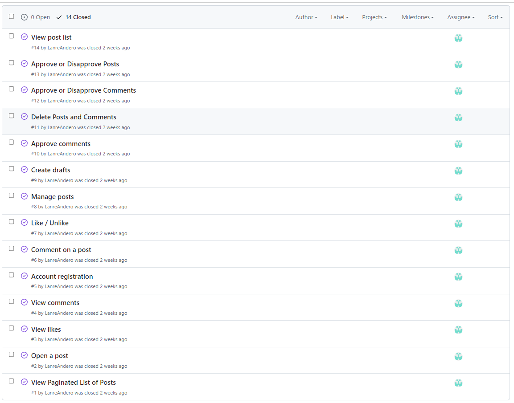
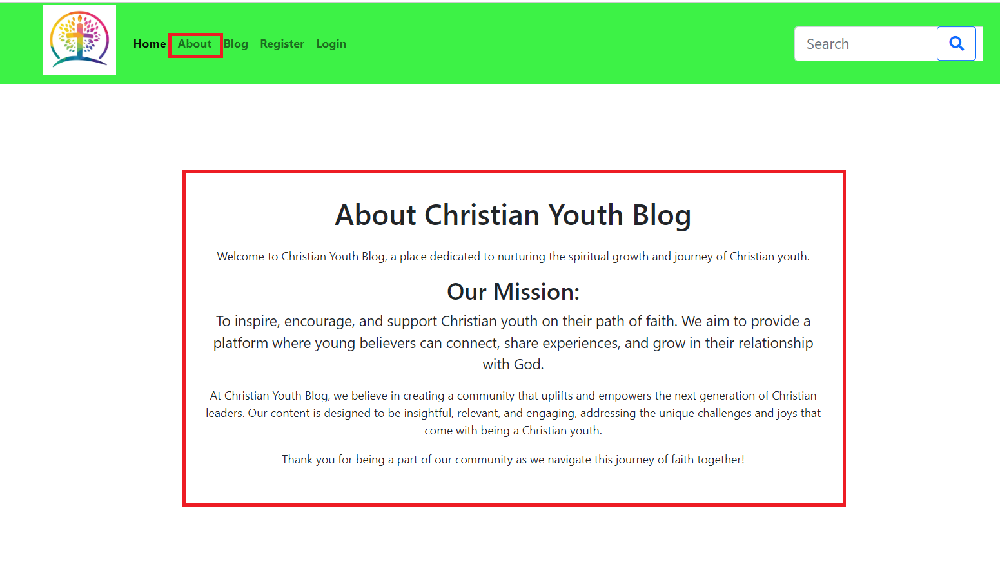
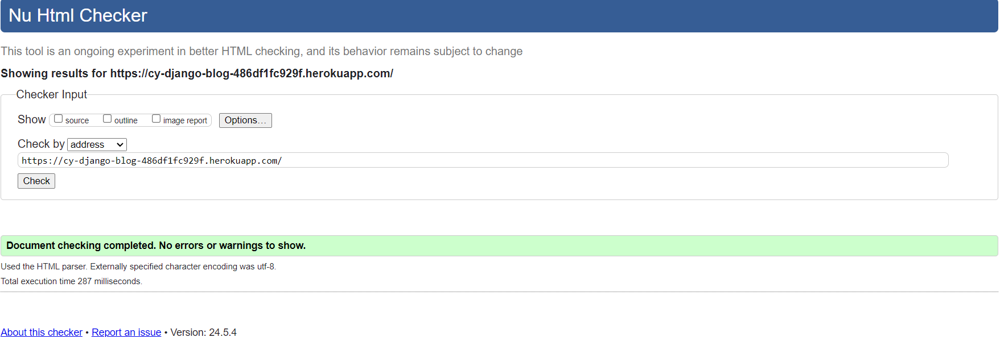
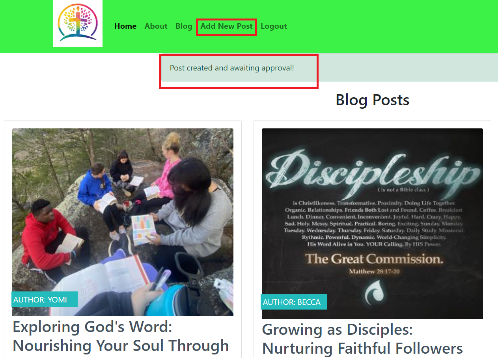

# Christian Youth Blog

**Developer: Lanre James Andero**

💻 [Visit live website](https://cy-django-blog-486df1fc929f.herokuapp.com/)  
(Ctrl + click to open in new tab)

## Table of Contents
  - [About](#about)
  - [User Goals](#user-goals)
  - [Site Owner Goals](#site-owner-goals)
  - [User Experience](#user-experience)
  - [User Stories](#user-stories)
  - [Design](#design)
    - [Fonts](#fonts)
    - [Structure](#structure)
      - [Website pages](#website-pages)
      - [Database](#database)
  - [Technologies Used](#technologies-used)
  - [Features](#features)
  - [Validation](#validation)
  - [Testing](#testing)
    - [Manual testing](#manual-testing)
    - [Automated testing](#automated-testing)
    - [Tests on various devices](#tests-on-various-devices)
    - [Browser compatibility](#browser-compatibility)
  - [Bugs](#bugs)
  - [Heroku Deployment](#heroku-deployment)
  - [Credits](#credits)
  - [Acknowledgements](#acknowledgements)

### About

Christian Youth Blog is a platform aims to provide a space for Christian youth to explore, share, and engage with content that aligns with their faith and values. Discover articles, stories, and discussions that inspire and connect the Christian youth community.

### User Goals

- Access content that aligns with Christian values.
- Engage with a community of like-minded Christian youth.
- Find inspiration, guidance, and encouragement through blog articles.

### Site Owner Goals

- Establish a platform for Christian youth to share and explore content.
- Foster a sense of community and connection among Christian youth.
- Provide valuable and uplifting content that resonates with the target audience.

## User Experience

### Target Audience
- Teenagers and young adults who are exploring their faith and seeking guidance in their spiritual journey. They may have 
  questions, doubts, and uncertainties about their beliefs and are looking for resources to help them navigate these challenges.
- Youth who are actively involved in their local church community or youth group. They may be seeking content that helps them 
  deepen their understanding of Christian teachings, engage with Scripture, and live out their faith in their daily lives.
- Christian youth who are looking for encouragement, inspiration, and practical advice to help them overcome obstacles, grow 
  spiritually, and live out their faith authentically in today's world.
- As digital natives, this audience is accustomed to consuming content online. They are likely to engage with multimedia content 
  such as blog posts, videos, and social media updates that resonate with their interests and address their spiritual needs.
- Christian youth who are interested in connecting with like-minded peers, sharing experiences, and building a supportive online 
  community where they can discuss faith, ask questions, and encourage one another on their journey of faith.

### User Requirements and Expectations

- Fully responsive
- Accessible
- A welcoming design
- Social media
- Contact information

##### Back to [top](#table-of-contents)

## User Stories

### Users

1. As a Site User, I can like or unlike a post so that I can interact with the content

2. As a Site User, I can view a paginated list of posts so that I can select which post I want to view

3. As a Site User, I can view the number of likes on each post so that I can see which is the most popular or viral

4. As a Site User, I can view a list of posts so that I can select one to read

5. As a Site User, I can click on a post so that I can read the full text

6. As a Site User, I can register an account so that I can comment, like and unlike

7. As a Site User, I can leave comments on a post so that I can be involved in the conversation

8. As a Site User, I can view comments on an individual post so that I can read the conversation

9. As a Site User, I can create, read, update and delete own posts so that I can manage my blog content

10. As a Site User, I can edit and delete own posts so that I can review my conversation

11. As a user I can see my login status so that I know if I am logged in or not

Site Users Access

### Site Admin / Authorised User
12.	As an Admin / Authorised User I can log in so that I can access the back end of the site

13. As a Site Admin, I can create, read, update and delete any posts so that I can manage all blog content

14. As a Site Admin, I can create draft posts so that I can finish writing the content later

15. As a Site Admin, I can approve or disapprove comments so that I can filter out objectionable comments

16. As a Site Admin, I can approve or disapprove posts so that I can filter out objectionable posts

Site Admin Rights

### Site Owner  
17. As a Site Owner I can provide a fully responsive site for my customers so that they have a good user experience
18. As a Site Owner I can validate data entered into my site so that all submitted data is correct to avoid errors

### Kanban, Epics & User Stories
- GitHub Kanban was used to track all open user stories
- To Do, In Progress, Done headings were used in the kanban

User Stories

Kanban

##### Back to [top](#table-of-contents)

## Design

### Fonts

The font selected was from Google Fonts, Lato with sans-serif as a backup font.

See Font Image

### Structure

#### Website pages

The site was designed for the user to be familiar with the layout such as a navigation bar along the top of the pages and a hamburger menu button for smaller screen.

The footer contains all relevant social media links that the business has so the user can visit any social media site and follow the business there to expand the businesses followers, likes and shares.

- The site consists of the following pages:
Upon entering the blog, users will find a clean and intuitive interface. Key navigation options include:
1. Home - Explore the latest blog posts.
2. About - Learn more about the blog's mission and values.
3. Blog - Users can view blog post
4. Register - New users can sign up
5. Login - Registered users can sign in
6. Signed In - Users can create, edit and delete own posts, comments and likes/unlikes posts.
6. Add New Post - Signed in users can create a new post
7. Logout- Singned in users can logout of their accounts
8. Search Box - Users can search for posts by title, category and tag

Home Page Navigations

#### Database

- Built with Python and the Django framework with a database of a Postgres for the deployed Heroku version(production)
- Two database model shows all the fields stored in the database

##### Post Model
The Post Model contains the following:
- title
- post_id (PrimaryKey)
- author (ForeignKey)
- created_date
- updated_date
- content
- featured_image
- excerpt
- slug
- status
- categories
- Tags

##### Comment Model
The Comment Model contains the following:
- post (ForeignKey)
- name
- email
- body
- created_date
- approved
- Meta: created_on

## Technologies Used

### Languages & Frameworks

- HTML
- CSS
- Javascript
- Python
- Django

### Libraries & Tools

- [Am I Responsive](http://ami.responsivedesign.is/)
- [Bootstrap v4.0](https://getbootstrap.com/)
- [Cloudinary](https://cloudinary.com/)
- [Favicon.io](https://favicon.io)
- [Chrome dev tools](https://developers.google.com/web/tools/chrome-devtools/)
- [Font Awesome](https://fontawesome.com/)
- [Git](https://git-scm.com/)
- [GitHub](https://github.com/)
- [Google Fonts](https://fonts.google.com/)
- [Heroku Platform](https://id.heroku.com/login)
- [jQuery](https://jquery.com)
- [Postgres](https://www.postgresql.org/)
- [Summernote](https://summernote.org/)
- Validation:
  - [WC3 Validator](https://validator.w3.org/)
  - [Jigsaw W3 Validator](https://jigsaw.w3.org/css-validator/)
  - [JShint](https://jshint.com/)
  - [CI Python Linter](https://pep8ci.herokuapp.com/)
  - [Lighthouse](https://developers.google.com/web/tools/lighthouse/)

##### Back to [top](#table-of-contents)

## Features

### Home page
- Home page includes nav bar, main body and a footer

See feature images

### Logo & Navigation
- Custom logo for the business
- Fully Responsive
- On small screens switches to hamburger menu
- Indicates login/logout in status
- displayed on all pages

See feature images

### Footer
- Contains contact details, social media links and copyright
- displayed across all pages

See feature images

### Sign up / Register
- Allow users to register an acoount
- Username and password is required, email is optional

See feature images

### Login
- User can login to create, view, edit and delete posts

See feature images

### Logout
- Allows the user to securely log out
- Ask user if they are sure they want to log out

See feature images

### Blog
- The blog displays each post made by admin, staff member and registered users
- User created posts are subject to approval by the admin or staff member
- Paginations is used to display 6 posts per page
  

See feature images

### Blog Detail
- Expands into the selected blog the user wishes to read
- Displays a featured image uploaded by the poster
- If no image is uploaded a default image is then used
- Registerd user can comment on the blog
  

See feature images

### Comments
- Comments made are set to pending approval status to ensure nothing bad is displayed
- Only registered users can comment on a blog post
- Staff can approve comments via the admin panel on the backend
  

See feature images

### Contact Us
- Contact info such as, phone, email, and address is displayed
  

See feature images

### Social Media Links
- A logo and link is used for each social media displayed
- All links open in a new tab to ensure user is not directed away from the blog
- Displayed on all pages
  

See feature images

### Pagination
- Pagination is used on the blog page
- Ensures the page is kept tidy as only 6 items are displayed per page
  

See feature images

##### Back to [top](#table-of-contents)

## Validation

The W3C Markup Validation Service

Whole Website

Register

### CSS Validation
The W3C Jigsaw CSS Validation Service

Style.css

### JavaScript Validation
JSHint JS Validation Service

Script.js

### PEP8 Validation
PEP8 Validation Service used to check the code for PEP8 requirements via CI Python Linter was down

Tool used: CI Python Linter

christian_youth_blog

asgi.py

settings.py

urls.py

wsgi.py

Blog

admin.py

apps.py

forms.py

models.py

urls.py

views.py

Root

env.py

manage.py

### Lighthouse

Performance, best practices and SEO was tested using Lighthouse.

#### Desktop

Index

Register

Login

Logout

Blog

Blog Detail

About Us

Add New Post

Edit Post

Delete Post

Search

##### Back to [top](#table-of-contents)

## Testing

1. Manual Testing
2. Automated testing

### Manual testing

1. As a User I can navigate across the site so that I can move to each feature of the site easily

**Step** | **Expected Result** | **Actual Result**
------------ | ------------ | ------------ |
| Click on the 'Home' link in the navigation bar | Homepage will load| Works as expected |
| Click on the 'Register' link in the navigation bar | Sign up page will load| Works as expected |
| Click on the 'Login' link in the navigation bar | Login page will load| Works as expected |
| Click on the 'Blog' link in the navigation bar | Blog page will load| Works as expected |
| Click on the 'About' link in the navigation bar | About us page will load| Works as expected |
| Click on the 'Add New Post' link in the navigation bar | Create a new post page will load| Works as expected |
| Click on the 'Logout' link in the navigation bar | Logout page will load| Works as expected |
| Click inside the 'Search Box' link in the navigation bar | Type relevant search word and enter| Works as expected |

2. As a User I can use a navbar, footer, and social icons so that I can navigate the site, access menus, and access socials

**Step** | **Expected Result** | **Actual Result**
------------ | ------------ | ------------ |
 | See test 1 | See test 1 | Works as expected |
 | Scroll to footer at bottom of page | find footer | Works as expected |
 | Scroll to footer at bottom of page | find social links | Works as expected |

3. As a Site Owner I can provide a contact us page so that users can get in touch with my blog

**Step** | **Expected Result** | **Actual Result**
------------ | ------------ | ------------ |
| Scroll to footer at bottom of page | Contact us detail are display | Works as expected |

4. As an Admin / Authorised User I can log in so that I can access the back end of the site

**Step** | **Expected Result** | **Actual Result**
------------ | ------------ | ------------ |
| Visit the admin page https://cy-django-blog-486df1fc929f.herokuapp.com/admin/login/?next=/admin/ | Enter admin login credentials, gain access to back end | Works as expected |

5. As a Admin I can draft, create, read, edit, approve and delete any post from the database so that we can add, remove, edit and view all our posts

**Step** | **Expected Result** | **Actual Result**
------------ | ------------ | ------------ |
| Visit the admin page https://cy-django-blog-486df1fc929f.herokuapp.com/admin/login/?next=/admin/ | Enter admin login credentials, gain access to back end | Works as expected |
| Click on the Posts / Comments on the left panel, select an item | Item Form is displayed allowing to create, draft or publish, approve, edit and delete post, approve comment |Works as expected |

6. As a User I can I am notified so that I know my action of creation, edit, or deletion of own post has been successful

**Step** | **Expected Result** | **Actual Result**
------------ | ------------ | ------------ |
| From the 'Add New Post' page, create a post | A message will be displayed upon completion, Javascript makes it disappear after 5 seconds | Works as expected |
| From the 'Blog Detail' page, edit own post | A message will be displayed upon completion, Javascript makes it disappear after 5 seconds | Works as expected |
| From the 'Blog Detail' page, delete own post | A message will be displayed upon completion | Works as expected |

7. As a User I can register as prompted so that I can create a new post and leave comment if I wish

**Step** | **Expected Result** | **Actual Result**
------------ | ------------ | ------------ |
| Click on the 'Register' link in the navigation bar | Register an account to allow creating a post and comments to be made | Works as expected |

8. As a user I can see my login status so that I know if I am logged in or not

**Step** | **Expected Result** | **Actual Result**
------------ | ------------ | ------------ |
| While logged in, view navigation bar | Logout button should be visible | Works as expected |

10. As a User I can view the site's blog so that I can learn additional information and read articles

**Step** | **Expected Result** | **Actual Result**
------------ | ------------ | ------------ |
| Select Blog in navigation panel at top of page | Blog page loads with published Blog posts | Works as expected |

11. As a Site Owner I can validate data entered into my site so that all submitted data is correct to avoid errors

**Step** | **Expected Result** | **Actual Result**
------------ | ------------ | ------------ |
| From register page, register an account with invalid email | Error message is displayed | Works as expected |
| From register page, register an account with an existing user name | Error message is displayed | Works as expected |

12. As a User I can view blog posts page by page so that I can browse without seeing an overloaded page

**Step** | **Expected Result** | **Actual Result**
------------ | ------------ | ------------ |
| Select Blog from navigation panel at top of page | Blog page loads, paginated to display only 6 per page | Works as expected |

### Automated Testing

- No Automated Testing was done in this project

### Device Testing & Browser compatibility

The site uses to test on various real world devices was [BrowserStack](https://cy-django-blog-486df1fc929f.herokuapp.com/)  

This allowed me to test on real devices and not just device emulators.

The following devices were used to test my site:

Samsung Galaxy S22 Ultra

Apple iPhone 15

iPad Pro 12.9" 2021

OnePlus 9

Google Pixel 7 Pro

Mozilla Firefox (v105 latest)

Google Chrome (v106 latest)

Microsoft Edge (v126 latest)

Opera (v109 latest)

Safari (Sanoma v17.3 latest)

##### Back to [top](#table-of-contents)

## Bugs

No known bug

##### Back to [top](#table-of-contents)

### Heroku Deployment

[Official Page](https://devcenter.heroku.com/articles/git) (Ctrl + click)

This application has been deployed from Github using Heroku. Here's how:

1. Create an account at heroku.com

2. Create an app, give it a name for such as cy-django-blog, and select a region

3. Under settings, scroll down and revealthe config vars, and add a Cloudinary variables to the app

Heroku Postgres

1. Note the DATABASE_URL, this can be set as an environment variable in Heroku and your local deployment(env.py)

2. Install the plugins dj-database-url and psycopg2-binary.

3. Run pip3 freeze > requirements.txt so both are added to the requirements.txt file

4. Create a Procfile with the text: web: gunicorn the_diplomat.wsgi

5. In the settings.py ensure the connection is to the Heroku postgres database, no indentation if you are not using a seperate test database.
I store mine in env.py

6. Ensure debug is set to false in the settings.py file

7. Add localhost, and cy-django-blog.herokuapp.com to the ALLOWED_HOSTS variable in settings.py

8. Run "python3 manage.py showmigrations" to check the status of the migrations

9. Run "python3 manage.py migrate" to migrate the database

10. Run "python3 manage.py createsuperuser" to create a super/admin user

11. Run "python3 manage.py loaddata categories.json" on the categories file in products/fixtures to create the categories

12. Run "python3 manage.py loaddata products.json" on the products file in products/fixtures to create the products

13. Install gunicorn and add it to the requirements.txt file using the command pip3 freeze > requirements.txt

14. Disable collectstatic in Heroku before any code is pushed using the command heroku config:set DISABLE_COLLECTSTATIC=1 -a cy-django-blog

15. Ensure the following environment variables are set in Heroku

16. Connect the app to GitHub, and enable automatic deploys from main if you wish

17. Click deploy to deploy your application to Heroku for the first time

18. Click on the link provided to access the application

19. If you encounter any issues accessing the build logs is a good way to troubleshoot the issue

### Fork Repository
To fork the repository by following these steps:
1. Go to the GitHub repository
2. Click on Fork button in upper right hand corner

### Clone Repository
You can clone the repository by following these steps:
1. Go to the GitHub repository 
2. Locate the Code button above the list of files and click it 
3. Select if you prefere to clone using HTTPS, SSH, or Github CLI and click the copy button to copy the URL to your clipboard
4. Open Git Bash
5. Change the current working directory to the one where you want the cloned directory
6. Type git clone and paste the URL from the clipboard ($ git clone https://github.com/YOUR-USERNAME/YOUR-REPOSITORY)
7.Press Enter to create your local clone.

##### Back to [top](#table-of-contents)

## Credits

### Images

Images used were free and sourced from Pinterest.o.uk

### Code

Bootstrap dark navigation theme was used alongside boostrap classes and carousel

##### Back to [top](#table-of-contents)

## Acknowledgements

### Special thanks to the following:
- Code Institute
- My Mentor Mo Shami